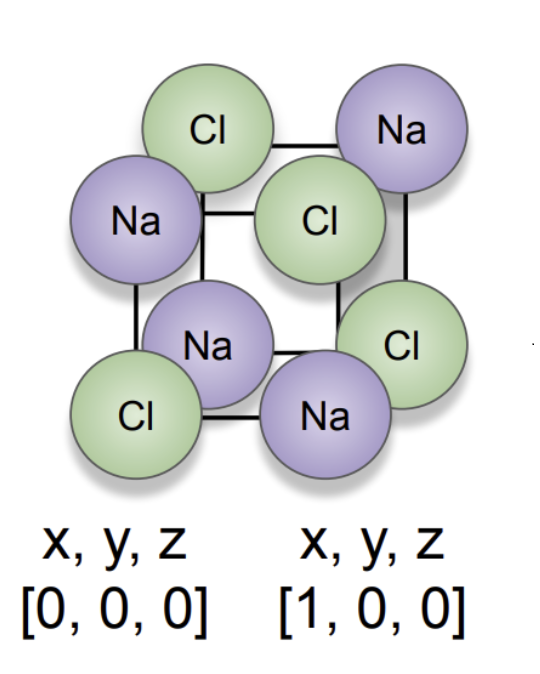
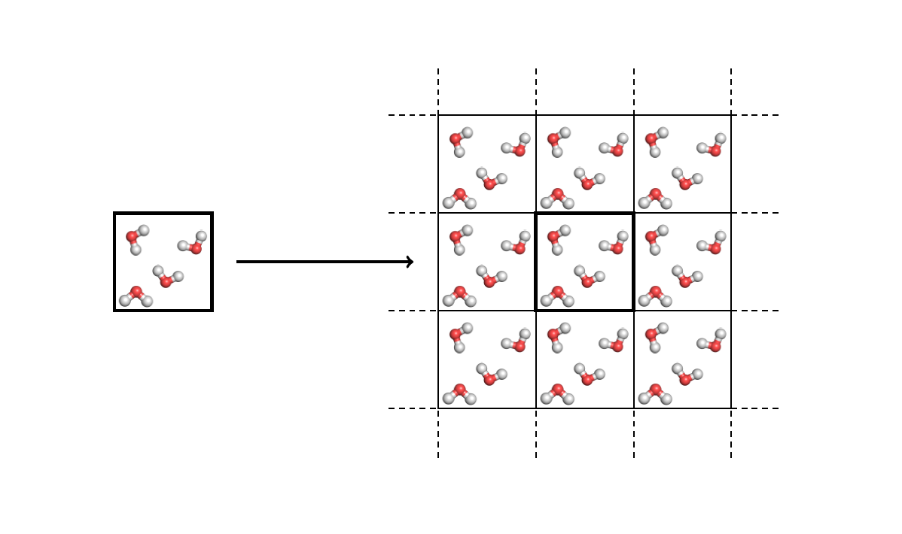
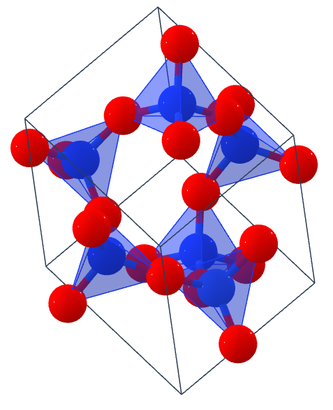
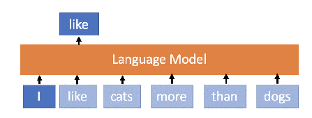
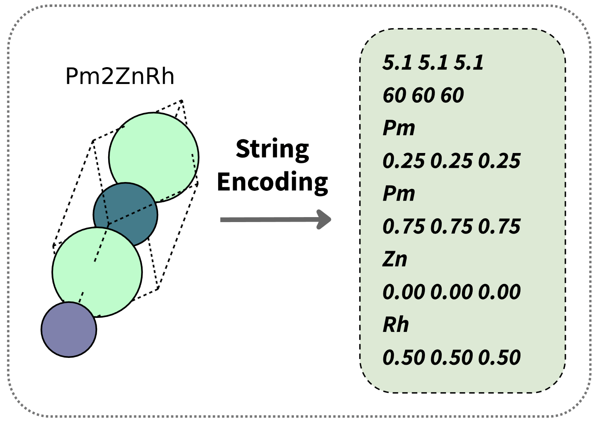
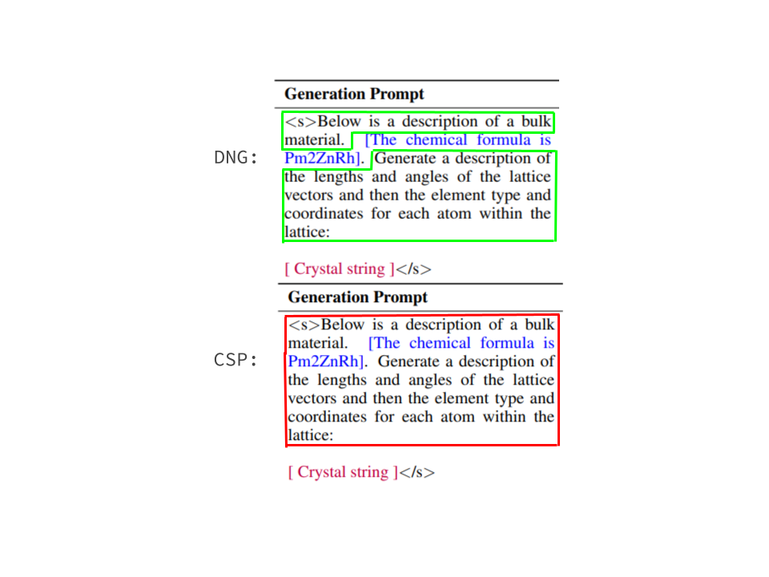
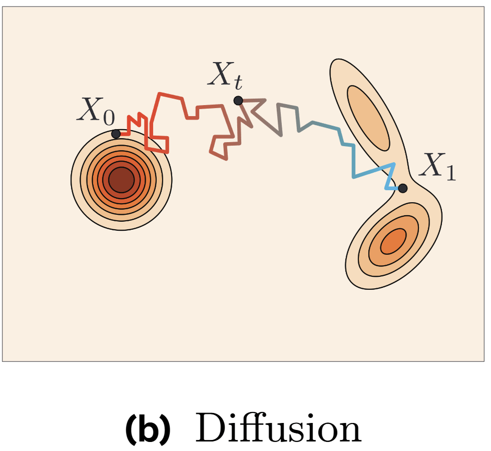
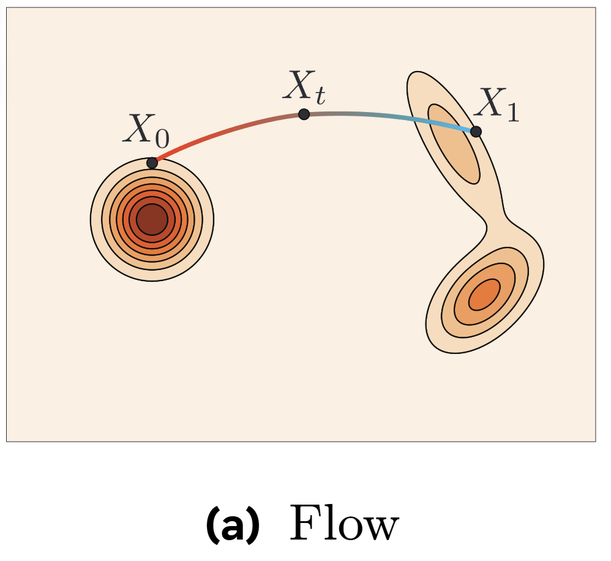
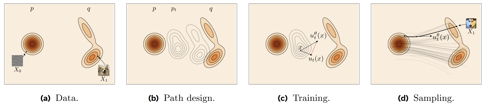

# Generative Models for 3D Atomistic Structure Discovery

<div class="flex justify-center">
  
</div>

<div class="absolute bottom-10">

<span class="font-700">
Nima Shoghi, Timothy Soetojo, Jamshid Hassanpour
</span>

Slides: [nima.sh/ece6254-presentation](https://nima.sh/ece6254-presentation)

</div>

<div class="absolute bottom-15 right-15">
<QRCode data="https://nima.sh/ece6254-presentation" />
</div>

<!--
Good afternoon everyone. Today we're presenting our project on generative models for 3D atomistic structure discovery.

This project explores how we can use AI to discover new materials by generating stable 3D atomic structures. Our work compares several cutting-edge deep learning approaches for this challenging task.

[The image shows a visualization of a crystal structure with atoms arranged in a 3D lattice - these complex arrangements determine the properties of materials we use every day, from electronics to medicine.]

We'll walk you through why this problem matters, our approach to solving it, and what we discovered from our experiments.
-->

---

# Why Materials Discovery Matters

<div class="grid grid-cols-2 gap-4">
<div>
<v-clicks>

- **Every technology starts with a material**
  - But discovery takes 20+ years lab-to-market

- **Finding the needle in a $10^{20}$ haystack**
  - Only ~1 in 100,000 structures are stable
  - Vast combinatorial space to explore

- **Generative ML: The "Virtual Lab"**
  - AI trained on known stable structures
  - Generates novel, physically realistic candidates
  - Impact: Batteries, Carbon Capture, Drug Delivery

</v-clicks>
</div>

<div class="flex items-center justify-center">
  
</div>
</div>

<!--
Let's understand why materials discovery is so important and challenging.

[click] Every technology we rely on - from smartphones to solar panels - starts with a material discovery. But traditionally, bringing a new material from lab discovery to market application takes over 20 years. This slow cycle limits technological progress.

[click] The challenge is finding viable materials in an astronomically large search space. There are approximately 10²⁰ possible inorganic materials, but only about 1 in 100,000 structures are chemically stable enough to synthesize. Finding these rare stable structures manually is like finding a needle in a cosmic-sized haystack.

[click] This is where generative machine learning becomes our "virtual lab." By training AI on databases of known stable materials, we can generate novel candidates that have a much higher probability of stability. This approach could revolutionize how we discover materials for critical applications like next-generation batteries, carbon capture technologies, and targeted drug delivery systems.

[click] The image on the right shows a visualization of a crystal structure. Our project specifically compares different state-of-the-art generative methods to determine which approaches best capture the physical constraints that make materials stable in the real world.
-->

---
layout: default
---

# What Defines a Material Structure?

<div class="grid grid-cols-12 gap-4">
<div class="col-span-8">
<v-clicks>

- **Fundamentally: Atoms in 3D Space**
  - Positions of atoms in xyz coordinates
  - Chemical elements at each position (C, Si, O, etc.)

- **Materials are Infinite Periodic Structures**
  - Not just a handful of atoms, but infinitely repeating
  - Most materials form ordered, crystalline arrangements

- **Three Essential Components**
  - Unit Cell/Lattice: The repeating 3D "box"
  - Atom Types: Elements present in the material
  - Fractional Coordinates: Positions within the cell (0-1)

</v-clicks>
</div>

<div class="flex flex-col items-center justify-center space-y-4 col-span-4">
  <div v-click="1" class="flex items-center justify-center mt--10">

  <!--  -->
  
  <div class="text-xs ml-2">Atoms within one unit cell</div>
  </div>
  <div v-click="2" class="flex items-center justify-center">

  <!--  -->

  <div class="flex flex-col items-center gap-2 ml--20">
  
  <div class="text-xs ml-2">Infinitely repeating structure</div>
  </div>

  </div>
</div>
</div>


<!--
Let's get concrete about what we're actually trying to generate.

[click] At the most basic level, materials are collections of atoms positioned in 3D space. Each atom has a specific location and a chemical identity (like carbon, silicon, or oxygen). This is an intuitive way to think about materials - just atoms arranged in space.

[click] But what makes materials science challenging is that real materials aren't just a handful of atoms - they're infinitely repeating structures. Most solid materials form ordered, crystalline arrangements where the same pattern of atoms repeats in all directions throughout space. This periodic nature is fundamental to understanding and generating materials.

[click] To efficiently represent these infinite structures, we need three components:
- The unit cell or lattice: a 3D "box" defined by vectors that repeats throughout space
- The atom types: which chemical elements are present in our material
- The fractional coordinates: where each atom sits within the unit cell, using a 0-1 scale relative to the cell dimensions

-->

---
layout: default
---

# Two Key Generative Tasks

<div class="grid grid-cols-2 gap-8 mt-8">
<div v-click class="border p-4 rounded-lg bg-blue-50">
  <h3 class="text-xl text-blue-700 mb-2">De Novo Generation (DNG)</h3>
  <div class="flex mb-2 flex-row items-center justify-center">
  <div class="text-5xl font-bold mr-4">?</div>
  <div class="text-2xl mr-1">→</div>
  <!-- 2-Pnma.png) -->
  
  </div>
  <div class="text-sm mt-2">
  <b>Goal:</b> Generate completely new materials (composition + structure)
  </div>
  <div class="text-xs mt-2">
  <b>Evaluation metrics:</b> Validity, Coverage, Property Distribution
  </div>
</div>

<div v-click class="border p-4 rounded-lg bg-green-50">
  <h3 class="text-xl text-green-700 mb-2">Crystal Structure Prediction (CSP)</h3>
  <div class="flex mb-2 flex-row items-center justify-center">
  <div class="text-2xl font-bold mr-4">SiO₂</div>
  <div class="text-2xl mr-1">→</div>
  <!--  -->
  
  </div>
  <div class="text-sm mt-2">
  <b>Goal:</b> Predict stable structure given a specific composition (ie., chemical formula)
  </div>
  <div class="text-xs mt-2">
  <b>Evaluation metrics:</b> RMSE, Match Rate with ground truth
  </div>
</div>

<div v-click class="col-span-2 bg-gray-50 p-3 rounded-lg border text-center text-sm">
  Our study compares different generative approaches across both tasks
</div>
</div>

<!--
Let's understand the two fundamental generative tasks we're exploring in this project.

[click] First is De Novo Generation, or DNG. This is the more ambitious task where we aim to generate completely new materials from scratch. The model must learn to create both the chemical composition (what elements to use) and the 3D structure (how to arrange those atoms).

To evaluate DNG models, we look at:
- Validity: Are the generated structures physically plausible?
- Coverage: Do they represent diverse and realistic materials?
- Property distributions: Do their physical properties match those of real materials?

[click] The second task is Crystal Structure Prediction, or CSP. Here, we already know the chemical composition (like SiO₂ for quartz), but we need to predict the stable 3D arrangement of those atoms.

CSP is evaluated using:
- RMSE: How close are the predicted atom positions to the ground truth?
- Match Rate: What percentage of predictions match known structures within a reasonable tolerance?

[click] In our comparative study, we evaluate different generative approaches on both of these tasks to understand their strengths and limitations.
-->

---
layout: default
---

# Approach 1: Large Language Models

<div class="grid grid-cols-2 gap-4">

<div>

<v-clicks>

- **Core Idea:** Predict the next word (token) given the previous ones:  $p(w_{t+1} | w_{0:t})$
- **Generation:** Sample tokens sequentially.
  - `Input -> LLM -> Next Token`
  - Repeat: `Input + Next Token -> LLM -> ...`

- **Approach:** Fine-tune a pre-trained LLM (LLaMA-2) on text-encoded crystals.
  - Leverage LLM's existing knowledge & pattern recognition.

</v-clicks>

</div>

<div>

<!--  -->


</div>

</div>

---
layout: default
---

# Crystal Text LLM: Fine-tuning & Sampling

<div class="grid grid-cols-2 gap-4">

<div>
<v-clicks>

- **Approach:** Fine-tune a pre-trained LLM (LLaMA-2) on text-encoded crystals.
  - Leverage LLM's existing knowledge & pattern recognition.

- **Input:** Crystal structure as a formatted string.
  ```text
  # Example String
  5.0 5.0 5.0 # Lattice lengths
  90 90 90    # Lattice angles
  Si 0.0 0.0 0.0 # Atom type & coords
  Si 0.5 0.5 0.5
  ...
  ```

- **Training:** Parameter-Efficient Fine-Tuning (PEFT) using LoRA.
  - Adapts LLM to crystal data efficiently.
  - Uses task-specific prompts (generation, conditional, infilling).
  - Augmentations (e.g., random translations) teach symmetries.

- **Sampling:** Standard autoregressive generation.
  - Generate the crystal string token by token.
  - Parse the string back into a 3D structure.

</v-clicks>
</div>

<div class="flex flex-col items-center gap-2">

<!--  -->


<!--  -->


</div>


</div>

<!--
So, how do we apply LLMs to generate crystals? The Crystal Text LLM paper proposes a straightforward approach.

[click] Instead of designing complex architectures, they fine-tune a large, pre-trained LLM (LLaMA-2) on crystal data. The idea is to leverage the powerful pattern recognition abilities the LLM already possesses from its text pre-training.

[click] They represent the crystal structure – lattice parameters, atom types, and fractional coordinates – as a simple, formatted string. This converts the 3D problem into a 1D sequence generation task that LLMs excel at.

[click] Fine-tuning is done efficiently using techniques like LoRA (Low-Rank Adaptation), which only modifies a small fraction of the model's parameters. They use specific prompts to train the model for different tasks like unconditional generation, generating based on desired properties (conditional), or filling in missing atoms (infilling). Data augmentations, like randomly shifting coordinates, help the model learn physical symmetries.

[click] Generating a new crystal is then just standard autoregressive sampling. The model generates the formatted string token by token, and this string is then parsed back into a 3D crystal structure. This method achieved surprisingly good results, generating stable materials at high rates.
-->


---
layout: default
---

# Flow Matching: A More Efficient Alternative to Diffusion

<div class="grid grid-cols-2 gap-8">
<div>
<v-clicks>

- **Diffusion Models:** Stochastic random walks
  - Add random noise gradually (forward)
  - Learn to denoise step-by-step (reverse)
  - Uses SDE: $dx = f(x,t)dt + g(t)dw$

- **Flow Matching:** Deterministic straight paths
  - Direct transport from noise → data
  - Learn vector field for optimal flow
  - Uses ODE: $\frac{dx}{dt} = v_\theta(t, x)$

- **Advantages:**
  - More computationally efficient sampling
  - Simpler to train and implement
  - More flexible choice of base distribution

</v-clicks>
</div>

<div class="flex flex-col items-center justify-center">
  <!--  -->
  
  <!--  -->
  
  <div v-click="2" class="text-xs mt-2 ml--5">

  FM learns **deterministic paths** from noise to data distribution

  </div>
</div>
</div>

<!--
Let me explain Flow Matching and how it differs from diffusion models you might be more familiar with.

[click] Diffusion models work by gradually adding random noise to data in the forward process, then learning to reverse this process step by step. They're based on Stochastic Differential Equations, which involve randomness at each step. The equation shows how the change in x depends on both a deterministic term f and a stochastic term dw.

[click] Flow Matching, in contrast, learns deterministic straight-line paths from noise to data. Instead of random walks, it focuses on learning a vector field that transports points optimally between distributions. This approach uses Ordinary Differential Equations, which are deterministic. The equation shows how the change in x over time depends only on the learned vector field v_θ.

[click] The advantages of Flow Matching include significantly better computational efficiency during sampling, simpler training (no complex noise schedules to tune), and more flexibility in choosing base distributions, which is especially helpful for materials with complex geometries.

[click] In this illustration, you can see how Flow Matching learns direct paths from the noise distribution to the data distribution. Rather than meandering through a stochastic process, it follows optimal transport trajectories.

[click] This approach is particularly well-suited for our materials generation task because crystal structures have complex symmetries and constraints that are easier to handle with deterministic flows.
-->

---
layout: default
---

# FlowMM: Training and Sampling for Material Generation

<!--  -->


<div class="grid grid-cols-2 gap-4">
<div v-click class="col-span-1">

#### **Training the Vector Field:**
- Define base distributions for: atom positions (uniform on torus), atom types (binary encoding), lattice parameters (informed priors)
- Learn vector field $v_\theta$ that follows optimal transport paths
- Incorporates crystal symmetries: translation, rotation, permutation

</div>

<div v-click class="col-span-1">

#### **Sampling = Solving an ODE:**
- Draw from base distributions
- Integrate: $\frac{dx}{dt} = v_\theta(t, x)$ from $t=0$ to $t=1$
- Only ~50-250 steps needed (vs. 1000+ for diffusion)
- Result: Realistic 3D material structure

</div>
</div>

<!--
Now let's look at how FlowMM specifically works for generating materials. The image at the top visualizes how the vector field transforms random noise into realistic material structures.

[click] For training, FlowMM needs to learn a vector field that can transform simple distributions into complex material structures. It defines separate base distributions for different components:
- For atom positions, it uses a uniform distribution on a torus (to handle periodic boundary conditions)
- For atom types, it uses an efficient binary encoding rather than one-hot vectors
- For lattice parameters, it uses informed priors based on real materials

The model learns a vector field that follows optimal transport paths between these base distributions and real materials, while respecting crystal symmetries like translation, rotation, and permutation.

[click] For sampling, we simply solve an Ordinary Differential Equation. We:
1. Draw samples from our base distributions
2. Numerically integrate the ODE dx/dt = v_θ(t,x) from t=0 to t=1
3. The integration can be done with standard numerical methods like Euler or Runge-Kutta

The remarkable efficiency advantage is that we only need about 50-250 integration steps to get high-quality materials, compared to 1000+ steps typically needed for diffusion models. The result is a complete material specification with 3D atomic positions, atom types, and unit cell parameters that respect physical constraints and symmetries.
-->

---
layout: default
---

# Dataset and Evaluation Challenges

<div class="grid grid-rows-2 gap-6 h-full">
<div v-click class="border-2 p-5 rounded-lg bg-blue-50 flex flex-col items-center">
  <h3 class="text-2xl text-blue-700 mb-3">MP-20 Dataset</h3>
  <div class="flex items-center gap-10">
    
    <div class="flex flex-col gap-2">
      <div class="text-lg"><b>45,231</b> materials</div>
      <div class="text-lg"><b>89</b> elements</div>
      <div class="text-lg"><b>1-20</b> atoms per unit cell</div>
    </div>
  </div>
  <div class="text-sm mt-3 text-gray-700 max-w-3xl">
    A realistic dataset of experimentally known inorganic materials with mostly globally stable structures.
  </div>
</div>

<div v-click class="border-2 p-4 rounded-lg bg-amber-50">
  <h3 class="text-2xl text-amber-700 mb-2">Evaluation Challenges</h3>
  <div class="grid grid-cols-2 gap-4">
    <div class="flex items-center justify-center flex-col">
      <div class="text-4xl mb-2">⚛️</div>
      <div class="font-bold text-center">Gold Standard: DFT</div>
    </div>
    <div class="flex items-center justify-center flex-col">
      <div class="text-4xl mb-2">🔄</div>
      <div class="font-bold text-center">Physical Invariances</div>
    </div>
    <div class="flex items-center justify-center flex-col">
      <div class="text-4xl mb-2">📊</div>
      <div class="font-bold text-center">Proxy Metrics Needed</div>
    </div>
    <div class="flex items-center justify-center flex-col">
      <div class="text-4xl mb-2">⚖️</div>
      <div class="font-bold text-center">Quality vs. Diversity</div>
    </div>
  </div>
</div>
</div>

<!--
Let's start by understanding our dataset and the challenges in evaluating generative models for materials.

[click] Our study uses the MP-20 dataset - a comprehensive collection of 45,231 materials drawn from the Materials Project database. This dataset includes:
- 89 different chemical elements
- Materials with 1 to 20 atoms per unit cell
- Experimentally verified inorganic materials

What makes MP-20 particularly valuable is that it contains mostly globally stable materials that can actually be synthesized in a laboratory. This means a model that performs well on MP-20 has real potential for practical materials discovery.

[click] However, evaluating generative models for materials presents unique challenges:

First, while Density Functional Theory (DFT) calculations would be the gold standard for verifying if generated materials are truly stable, these quantum mechanical simulations are computationally prohibitive to run at scale.

Second, materials have multiple physical invariances - they remain identical under rotation, translation, permutation of atoms, and different choices of unit cell. This makes direct comparison difficult.

Third, because of these constraints, we must rely on proxy metrics that approximate physical validity and quality without running full quantum simulations.

Finally, there's an inherent trade-off between generating diverse structures and ensuring they're all physically realistic. Our metrics need to balance these considerations carefully.
-->

---
layout: default
---

# Evaluation Metrics

<div class="grid grid-cols-12 gap-8 h-full">
<div v-click class="border-2 p-4 rounded-lg bg-green-50 col-span-8">
<h3 class="text-xl text-green-700 mb-2">De Novo Generation Metrics</h3>

**Validity:**
- Structural: minimum atom distance > 0.5$\text{Å}$
- Compositional: charge neutrality

**Coverage:**
- Recall: % of real materials matched
- Precision: % of generated materials realistic

**Property Distribution:**
- Density: earth mover's distance to real distribution
- Number of elements: statistical match to real data

</div>

<div v-click class="border-2 p-4 rounded-lg bg-purple-50 col-span-4">
<h3 class="text-xl text-purple-700 mb-2">Crystal Structure Prediction Metrics</h3>

**Match Rate:** % of predictions matching ground truth structure

**RMSE:** Error in predicted atom positions

</div>
</div>

<!--
Now let's look at the specific metrics we use to evaluate our generative models, given the constraints we just discussed.

[click] For De Novo Generation - creating entirely new materials from scratch - we evaluate using three families of metrics:

Validity checks whether generated structures are physically plausible:
- Structural validity requires minimum atom distances greater than 0.5 Ångströms
- Compositional validity requires overall charge neutrality

Coverage measures both diversity and quality:
- Recall (COV-R) tells us what percentage of real materials are matched by our generated set
- Precision (COV-P) tells us what percentage of our generated materials are realistic

Property distribution metrics assess how well statistical properties of generated materials match real ones:
- We use earth mover's distance to compare density distributions
- We measure how well the distribution of number of elements matches real materials

[click] For Crystal Structure Prediction - predicting the 3D structure given a composition - we use two primary metrics:

Match Rate measures the percentage of predictions that match ground truth structures within tolerance.

RMSE quantifies the error in predicted atomic positions, normalized by the cube root of volume per atom, which approximates the atom radius.

These metrics together give us a comprehensive view of performance while working within our computational constraints.
-->

---
layout: default
---

# De Novo Generation Results

<style>

table thead tr th {
  text-align: center;
}

</style>

<div class="border-2 rounded-lg overflow-hidden">
  <table class="w-full text-center">
    <thead class="bg-blue-600 text-white">
      <tr>
        <th class="p-2">Model</th>
        <th colspan="2" class="p-2 border-l border-white">Validity (%) ↑</th>
        <th colspan="2" class="p-2 border-l border-white">Coverage (%) ↑</th>
        <th colspan="2" class="p-2 border-l border-white">Property Distribution ↓</th>
      </tr>
      <tr class="bg-blue-500 text-white text-sm">
        <th></th>
        <th class="p-1">Structural</th>
        <th class="p-1">Composition</th>
        <th class="p-1">Recall</th>
        <th class="p-1">Precision</th>
        <th class="p-1">Density</th>
        <th class="p-1"># Elements</th>
      </tr>
    </thead>
    <tbody>
      <tr v-click class="hover:bg-gray-100">
        <td class="p-2 font-bold border-t">LLaMA-2</td>
        <td class="p-2 border-t border-l">96.4</td>
        <td class="p-2 border-t border-l"><span class="font-bold text-green-600">93.3</span></td>
        <td class="p-2 border-t border-l">91.1</td>
        <td class="p-2 border-t border-l">94.9</td>
        <td class="p-2 border-t border-l">3.61</td>
        <td class="p-2 border-t border-l">1.06</td>
      </tr>
      <tr v-click class="hover:bg-gray-100">
        <td class="p-2 font-bold border-t">CDVAE</td>
        <td class="p-2 border-t border-l"><span class="font-bold text-green-600">100</span></td>
        <td class="p-2 border-t border-l">86.7</td>
        <td class="p-2 border-t border-l">99.15</td>
        <td class="p-2 border-t border-l">99.49</td>
        <td class="p-2 border-t border-l">0.688</td>
        <td class="p-2 border-t border-l">0.278</td>
      </tr>
      <tr v-click class="hover:bg-gray-100">
        <td class="p-2 font-bold border-t">FlowMM</td>
        <td class="p-2 border-t border-l">96.85</td>
        <td class="p-2 border-t border-l">83.19</td>
        <td class="p-2 border-t border-l"><span class="font-bold text-green-600">99.49</span></td>
        <td class="p-2 border-t border-l"><span class="font-bold text-green-600">99.58</span></td>
        <td class="p-2 border-t border-l"><span class="font-bold text-green-600">0.239</span></td>
        <td class="p-2 border-t border-l"><span class="font-bold text-green-600">0.083</span></td>
      </tr>
    </tbody>
  </table>
</div>

<div v-click class="mt-6 grid grid-cols-2 gap-4">
  <div class="border-2 p-3 rounded-lg bg-blue-50">
    <h3 class="text-lg font-bold text-blue-700">Key Findings</h3>
    <ul class="text-sm mt-2">
      <li><span class="font-bold">CDVAE</span> excels in structural validity (100%)</li>
      <li><span class="font-bold">LLaMA-2</span> has the best compositional validity</li>
      <li><span class="font-bold">FlowMM</span> dominates in coverage and property metrics</li>
    </ul>
  </div>
  <div class="border-2 p-3 rounded-lg bg-green-50">
    <h3 class="text-lg font-bold text-green-700">FlowMM Advantages</h3>
    <ul class="text-sm mt-2">
      <li><span class="font-bold">3x better</span> property distribution matching</li>
      <li>Highest precision and recall for material coverage</li>
      <li>Best overall property distribution metrics</li>
    </ul>
  </div>
</div>

<!--
Let's examine the performance of our three models on De Novo Generation tasks.

[click] LLaMA-2 shows surprisingly good performance, particularly on compositional validity where it leads at 93.3%. However, it lags behind in coverage metrics and property distribution.

[click] CDVAE achieves perfect structural validity at 100%, ensuring all generated structures have reasonable atom spacing. It also shows strong coverage performance, but its property distribution metrics are not as strong as FlowMM.

[click] FlowMM demonstrates the best overall performance in most metrics. While it doesn't quite match CDVAE's structural validity or LLaMA-2's compositional validity, it excels in both coverage metrics (recall and precision) and dramatically outperforms the other models in property distribution matching.

[click] Looking at the key findings:
- CDVAE produces the most structurally valid materials
- LLaMA-2 creates the most charge-neutral compositions
- FlowMM generates materials that most closely match the statistical properties of real materials, with approximately 3x better performance on property distribution metrics

This suggests that FlowMM's deterministic paths from noise to data distribution result in higher quality material generation that better captures the underlying distribution of real materials, despite slight tradeoffs in validity.
-->

---
layout: default
---

# Crystal Structure Prediction Results

<style>

table thead tr th {
  text-align: center;
}

</style>

<div class="border-2 rounded-lg overflow-hidden">
  <table class="w-full text-center">
    <thead class="bg-purple-600 text-white">
      <tr>
        <th class="p-2">Model</th>
        <th class="p-2 border-l border-white">Match Rate (%) ↑</th>
        <th class="p-2 border-l border-white">RMSE ↓</th>
      </tr>
    </thead>
    <tbody>
      <tr v-click class="hover:bg-gray-100">
        <td class="p-2 font-bold border-t">LLaMA-2</td>
        <td class="p-2 border-t border-l">55.85</td>
        <td class="p-2 border-t border-l"><span class="font-bold text-green-600">0.0437</span></td>
      </tr>
      <tr v-click class="hover:bg-gray-100">
        <td class="p-2 font-bold border-t">CDVAE</td>
        <td class="p-2 border-t border-l">33.90</td>
        <td class="p-2 border-t border-l">0.1045</td>
      </tr>
      <tr v-click class="hover:bg-gray-100">
        <td class="p-2 font-bold border-t">FlowMM</td>
        <td class="p-2 border-t border-l"><span class="font-bold text-green-600">61.39</span></td>
        <td class="p-2 border-t border-l">0.0566</td>
      </tr>
    </tbody>
  </table>
</div>

<div v-click class="mt-6 grid grid-cols-2 gap-4">
  <div class="border-2 p-3 rounded-lg bg-blue-50">
    <h3 class="text-lg font-bold text-blue-700">Key Findings</h3>
    <ul class="text-sm mt-2">
      <li><span class="font-bold">FlowMM</span> achieves highest match rate (61.39%)</li>
      <li><span class="font-bold">LLaMA-2</span> produces lowest positional error</li>
      <li><span class="font-bold">CDVAE</span> lags behind in both metrics</li>
    </ul>
  </div>
  <div class="border-2 p-3 rounded-lg bg-yellow-50">
    <h3 class="text-lg font-bold text-yellow-700">LLaMA-2 Advantage</h3>
    <ul class="text-sm mt-2">
      <li>Pre-trained on vast GitHub repository data</li>
      <li>Likely exposed to materials science code/papers</li>
      <li>May have seen similar structures during pre-training</li>
    </ul>
  </div>
</div>

<!--
Now let's examine how our models perform on Crystal Structure Prediction tasks.

[click] LLaMA-2 shows impressive performance with a match rate of 55.85% and the best RMSE of 0.0437, indicating high precision in predicting atomic positions.

[click] CDVAE underperforms compared to the other models in both metrics, with a match rate of only 33.9% and the highest positional error.

[click] FlowMM achieves the highest match rate at 61.39%, successfully predicting structures for nearly two-thirds of test compositions. Its RMSE is slightly higher than LLaMA-2's but still considerably better than CDVAE's.

[click] The key takeaways are:
- FlowMM demonstrates superior ability to match ground truth structures
- LLaMA-2 shows the highest precision in atomic positioning
- CDVAE lags behind in both structure matching and positional accuracy

It's worth noting that LLaMA-2's strong performance may be partially attributed to its pre-training on GitHub's entire repository data. This likely exposed it to materials science code, papers, and possibly even the exact structures in our test set, giving it an inherent advantage in this comparison.
-->

---
layout: cover
class: text-center
---

# Generated Samples

<div class="grid grid-cols-5 gap-4 items-center">
  <div class="col-span-4">
    
  </div>
  <div class="col-span-1 flex flex-col items-center gap-4">
    <div class="bg-white p-3 rounded-lg">
      <QRCode data="https://ece6254.nima.sh" />
    </div>
    <a href="https://ece6254.nima.sh" class="text-white bg-blue-600 px-4 py-2 rounded-lg shadow-md hover:bg-blue-700 transition-colors">
      Interactive Demo: ece6254.nima.sh
    </a>
    <div class="text-white text-xs mt-2">
      20K generated structures in UMAP space<br>
      Colored by generating model<br>
      Embeddings extracted with JMP
    </div>
  </div>
</div>

<!--
Here we're visualizing 20,000 different material structures generated by our three models. This visualization gives us a qualitative way to compare the distribution of materials created by each approach.

We extracted embeddings from all structures using a popular pre-trained model called JMP, which captures key structural and chemical features of materials. Then we projected these high-dimensional embeddings down to 2D using UMAP for visualization.

Each point represents a single generated structure, and the colors indicate which model produced it. This allows us to see how the different models explore the materials space - where they overlap and where they generate unique structures.

You can explore this visualization interactively by visiting our demo site or scanning the QR code. The interactive version allows you to hover over points to see the specific structures and their properties.
-->

---
layout: default
---

# Analysis and Conclusions

<div class="grid grid-cols-3 gap-4">
  <div v-click class="border-2 p-3 rounded-lg bg-blue-50">
    <h3 class="text-lg font-bold text-blue-700 mb-2">Key Findings</h3>
    <ul class="text-sm">
      <li>FlowMM: Best match rate & property distribution</li>
      <li>LLaMA-2: Strong positional & compositional accuracy</li>
      <li>CDVAE: Perfect structural validity</li>
    </ul>
  </div>

  <div v-click class="border-2 p-3 rounded-lg bg-green-50">
    <h3 class="text-lg font-bold text-green-700 mb-2">Insights</h3>
    <ul class="text-sm">
      <li>ODEs > SDEs for realistic distributions</li>
      <li>LLMs contain implicit materials knowledge</li>
      <li>Base distribution choice matters</li>
    </ul>
  </div>

  <div v-click class="border-2 p-3 rounded-lg bg-purple-50">
    <h3 class="text-lg font-bold text-purple-700 mb-2">Future Directions</h3>
    <ul class="text-sm">
      <li>Hybrid flow matching + LLM models</li>
      <li>Improve compositional validity</li>
      <li>Scale to larger structures (>20 atoms)</li>
    </ul>
  </div>
</div>

<div v-click class="mt-6 border-2 p-3 rounded-lg bg-amber-50">
  <h3 class="text-lg font-bold text-amber-700 mb-1">Overall Assessment</h3>
  <p class="text-sm">
    Flow matching shows most promise for materials generation. Future systems will likely combine flow-based approaches with language model knowledge for optimal results.
  </p>
</div>

<!--
Let's step back and analyze what we've learned from our comparative study.

[click] Our key findings show clear differences between the three approaches:
- FlowMM consistently delivers the best match rate for crystal structure prediction and property distributions that closely match real materials
- LLaMA-2 surprised us with its accuracy in atomic positioning and ability to generate charge-neutral compositions
- CDVAE achieves perfect structural validity but falls behind in other important metrics
- The deterministic flow matching approach seems to better capture the underlying distribution of real materials

[click] These results offer several important insights:
- Deterministic ODE-based approaches like flow matching seem to generate more realistic property distributions than stochastic SDE-based methods like diffusion
- LLaMA-2's strong performance suggests large language models contain implicit knowledge about materials science that can be leveraged
- The choice of base distribution significantly impacts generation quality - FlowMM's flexibility in this area is a key advantage
- We observe a clear trade-off between structural validity and compositional accuracy across the models

[click] Looking toward the future, several promising directions emerge:
- Hybrid approaches that combine flow matching's efficiency with language models' knowledge could be particularly powerful
- Improving compositional validity in flow-based models is an important next step
- Exploring more complex symmetry constraints could lead to higher fidelity generation
- Scaling to larger structural units beyond 20 atoms per cell will be crucial for discovering novel complex materials

[click] Overall, flow matching methods show the most promise for material generation, offering better property distribution matching and competitive performance on stability metrics. The surprising effectiveness of LLMs suggests untapped potential in combining approaches. Future materials discovery systems will likely benefit from hybrid approaches that leverage complementary strengths of these different generative paradigms.
-->

---
layout: cover
class: text-center
---

# Thank you! --- Questions?

<div class="grid grid-cols-5 gap-4 items-center">
  <div class="col-span-4">
    
  </div>
  <div class="col-span-1 flex flex-col items-center gap-4">
    <div class="bg-white p-3 rounded-lg">
      <QRCode data="https://ece6254.nima.sh" />
    </div>
    <a href="https://ece6254.nima.sh" class="text-white bg-blue-600 px-4 py-2 rounded-lg shadow-md hover:bg-blue-700 transition-colors">
      Interactive Demo: ece6254.nima.sh
    </a>
    <div class="text-white text-xs mt-2">
      20K generated structures in UMAP space<br>
      Colored by generating model<br>
      Embeddings extracted with JMP
    </div>
  </div>
</div>

<!--
Here we're visualizing 20,000 different material structures generated by our three models. This visualization gives us a qualitative way to compare the distribution of materials created by each approach.

We extracted embeddings from all structures using a popular pre-trained model called JMP, which captures key structural and chemical features of materials. Then we projected these high-dimensional embeddings down to 2D using UMAP for visualization.

Each point represents a single generated structure, and the colors indicate which model produced it. This allows us to see how the different models explore the materials space - where they overlap and where they generate unique structures.

You can explore this visualization interactively by visiting our demo site or scanning the QR code. The interactive version allows you to hover over points to see the specific structures and their properties.
-->
