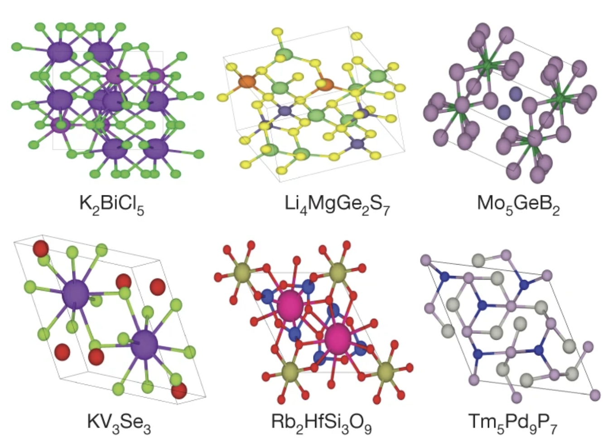
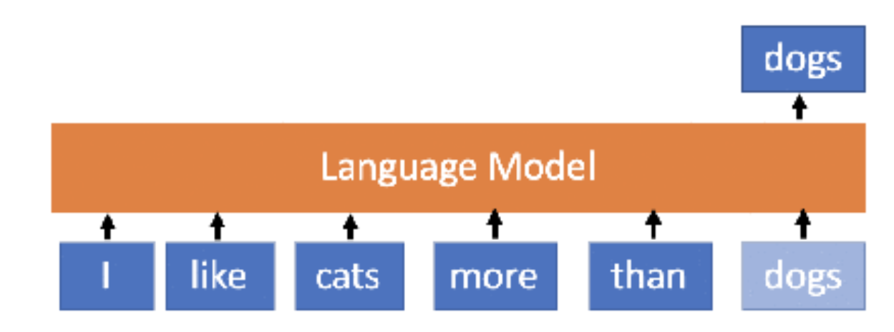
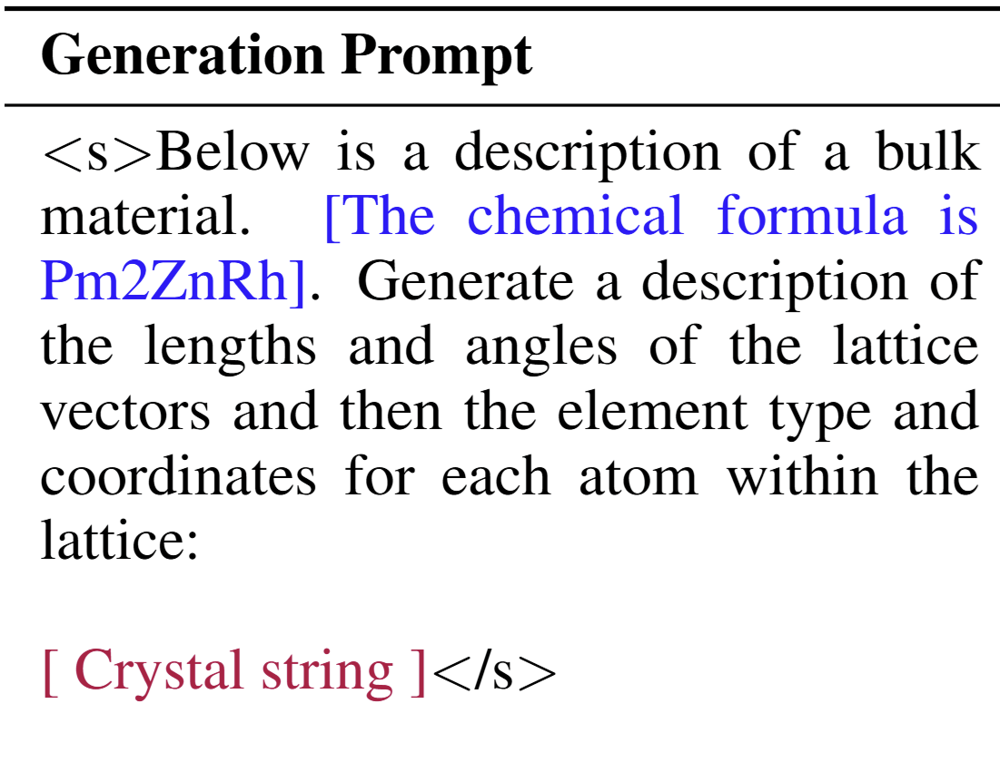
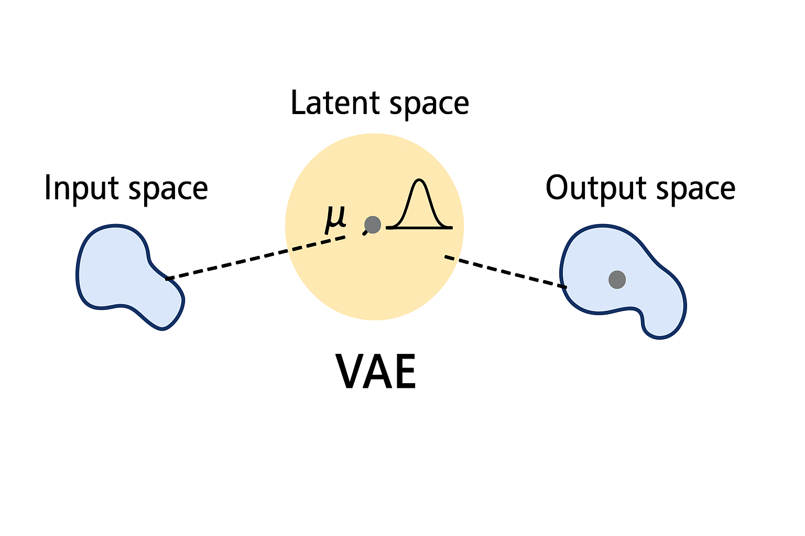
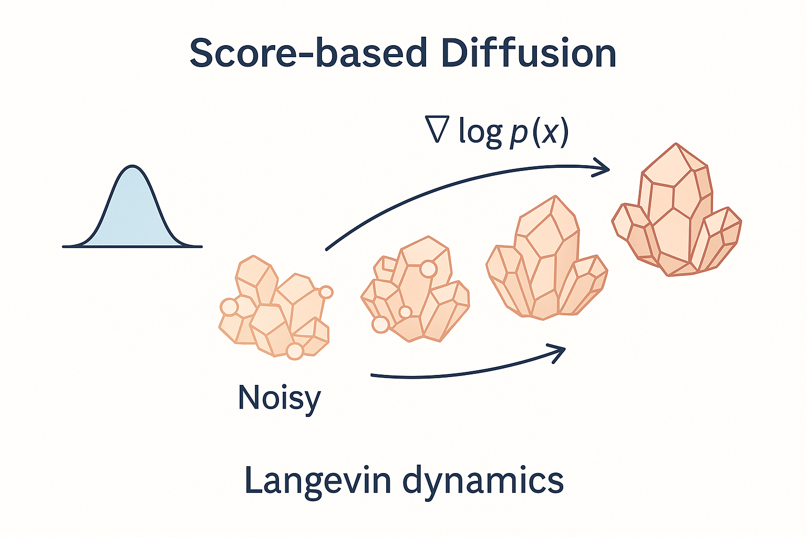

# Generative Models for 3D Atomistic Structure Discovery

Nima Shoghi, Timothy Soetojo, Jamshid Hassanpour

Slides: [nima.sh/ece6254-presentation](https://nima.sh/ece6254-presentation)

<QRCode data="https://nima.sh/ece6254-presentation" />

<!--
Good afternoon everyone. My name is Nima, and I'm here with my colleagues Timothy and Jamshid.

Our project explores how we can use AI to discover new materials via generative approaches. We'll walk you through why this problem matters, introduce 3 cutting-edge deep learning approaches for solving it, and what we discovered from our experiments.
-->

---

# Why Materials Discovery Matters

<v-clicks>

- **Every technology starts with a material**
  - But discovery takes 20+ years lab-to-market

- **Finding the needle in a $10^{20}$ haystack**
  - Only ~1 in 100,000 structures are stable
  - Vast combinatorial space to explore

- **Generative ML: The "Virtual Lab"**
  - AI trained on known stable structures
  - Generates novel, physically realistic candidates
  - Impact: Batteries, Carbon Capture, Drug Delivery

</v-clicks>

  <!-- <video v-click="3" src="https://unified-materials.github.io/unimat/materials/unimat.mp4" class="h-60 rounded shadow" autoplay loop muted /> -->
  <!--  -->
  

<!--
Let's understand why materials discovery is so important and challenging.

[click] Every technology we rely on - from smartphones to solar panels - starts with a material discovery. Traditionally, bringing a new material from lab discovery to market application takes over 20 years. This slow cycle limits technological progress.

[click] The challenge is finding viable materials in an astronomically large search space. There are approximately 10²⁰ possible inorganic materials, but only about 1 in 100,000 structures are chemically stable enough to synthesize.

[click] This is where generative machine learning becomes our "virtual lab." By training AI on databases of known stable materials, such as the ones on this slide, we can generate novel candidates that have a much higher probability of stability. This approach could revolutionize how we discover materials for critical applications like next-generation batteries, carbon capture technologies, and targeted drug delivery systems.

-->

---
layout: default
clicksStart: 2
---

# Material Structure

<v-clicks>

- **3D Atoms + Periodicity**
  - Atoms with positions and element types
  - Infinitely repeating crystalline patterns

- **Efficient Representation:**
  - **Unit Cell/Lattice:** Repeating 3D box
  - **Atom Types:** Elements in the material
  - **Fractional Coords:** Positions (0-1)

</v-clicks>

  
  

<!--
[click] At the lowest level, materials are collections of atoms arranged in 3D space (top figure).

There's 1 caveat: Materials form infinitely repeating crystalline structures. When we think of a material, we think of the smallest repeating unit that defines the material's structure, and this **unit cell** is then assumed to repeat infinitely in all directions (bottom figure).

[click] To generate a new material, our AI needs to learn the three key components:
- The unit cell/lattice: A repeating 3D box defined by vectors
- The atom types: Chemical elements present in the material
- The fractional coordinates: Positions of atoms within the cell (0-1 scale)

-->

---
layout: default
clicksStart: 3
---

# Crystal Text LLM: Intro --- Large Language Models

<v-clicks>

- **Core Idea:** Predict next words given previous ones
- **Generation:** Sample tokens sequentially.
  - `Input -> LLM -> Next Token`
  - Repeat: `Input + Next Token -> LLM -> ...`

- **Pre-trained on vast text corpora** containing:
  - Natural language (books, articles, etc.)
  - Code (Python, JavaScript, etc.)
  - Scientific literature (papers, patents, etc.)

</v-clicks>

<!--  -->
<!--  -->

<!--

Crystal Text LLM uses large language model techniques to predict the next token from the previous text, generating content one step at a time. It’s trained on massive data—books, code, and technical papers—giving it broad capabilities to understand and produce human-like text.

-->

---
layout: default
---

# Crystal Text LLM: Fine-tuning & Sampling

Approach: Fine-tune a pre-trained LLM (LLaMA-2) on text-encoded crystals.

Input Format: Converts complex 3D structure into a simple text sequence.

Training: Efficiently adapts LLM using LoRA and task prompts.

Output: Generates a text string representing a novel crystal.

<!--  -->

<!--  -->
<!--  -->

<!--
So, how do we apply LLMs to generate crystals? The Crystal Text LLM paper proposes a straightforward approach.

[click] Instead of designing complex architectures, they fine-tune a large, pre-trained LLM (LLaMA-2) on crystal data. The idea is to leverage the powerful pattern recognition abilities the LLM already possesses from its text pre-training.

[click] They represent the crystal structure – lattice parameters, atom types, and fractional coordinates – as a simple, formatted string. This converts the 3D problem into a 1D sequence generation task that LLMs excel at.

[click] Fine-tuning is done efficiently using techniques like LoRA (Low-Rank Adaptation), which only modifies a small fraction of the model's parameters. They use specific prompts to train the model for different tasks like unconditional generation, generating based on desired properties (conditional), or filling in missing atoms (infilling). Data augmentations, like randomly shifting coordinates, help the model learn physical symmetries.

[click] Generating a new crystal is then just standard autoregressive sampling. The model generates the formatted string token by token, and this string is then parsed back into a 3D crystal structure. This method achieved surprisingly good results, generating stable materials at high rates.
-->

---
layout: default
---

# CDVAE: Crystal Diffusion Variational AutoEncoder

<v-clicks>

- **VAE:** What to generate?
  - Captures overall structure of a crystal (atom, coordinates, lattice) and encodes it into a fixed latent space.
  - The latent space is modeled by a Gaussian distribution.

- **Score-based Diffusion:** How to generate accurately?
  - Learns a score function to guide Langevin dynamics.
  - Iteratively denoises atomic structures.

</v-clicks>

  <!--  -->
  
  <!--  -->
  
  

  

---
layout: default
---

# CDVAE: Training and Inference

#### **Training Stage:**
- Full crystal is encoded into $z$ to predict coarse properties.
- Atom type and coordination is perturbed by noise.
- Diffusion model denoises the structure conditioned on $z$, noisy structure and predicted properties.

#### **Sampling Stage:**
- Sample latent vector $z$ with Gaussian distribution.
- VAE predicts atoms, lattice and composition distribution.
- Coorinations in the unit cell are initialized randomly.
- Score model refined the noisy structure for a more precise output.

---
layout: default
---

# Flow Matching vs. Diffusion

<v-clicks>

- **Diffusion:** Stochastic process
  - Random noise + gradual denoising
  - SDE: $dx = f(x,t)dt + g(t)dw$

- **Flow Matching:** Deterministic transport
  - Direct paths from noise → data
  - ODE: $\frac{dx}{dt} = v_\theta(t, x)$

- **Key Advantages:**
  - Faster sampling (fewer steps)
  - Flexible base distributions
  - Better for complex geometries

</v-clicks>

  
  

<!--
The third approach we explore is Flow Matching, which offers a fundamentally more efficient way to generate materials.

[click] Diffusion models (like CDVAE) use a stochastic process - they gradually add random noise to data, then learn to reverse this noise step by step. This approach follows Stochastic Differential Equations that incorporate both deterministic drift and random Brownian motion. While effective, Langevin dynamics performs a non-optimal random walk through probability space, requiring many sampling steps and making the generation process less efficient (as seen on the top figure).

[click] Flow Matching instead learns deterministic and smooth paths directly from noise to data. It focuses on learning a vector field that optimally transports points between distributions using Ordinary Differential Equations.

[click] This approach offers several key advantages:
- Sampling requires significantly fewer steps (50-250 vs 1000+ for diffusion)
- It allows more flexible choice of base distributions, which is crucial for modeling physical structures
- The deterministic nature makes it better suited for handling the complex symmetries and constraints of crystal structures

The visualizations show how diffusion takes a meandering path through noise, while flow matching follows direct trajectories. This efficiency translates directly to faster material generation with better physical properties.
-->

---
layout: default
---

# FlowMM: Training and Sampling

### Training

- Define physics-informed base distributions
- Learn vector field $v_\theta$ for optimal transport
- Preserve crystal symmetries

### Sampling

- Draw from base distributions
- Solve ODE: $\frac{dx}{dt} = v_\theta(t, x)$
- 50-250 steps → realistic 3D structures

<!--
Now let's look at how FlowMM specifically works for generating materials. The image visualizes how the vector field transforms random noise into realistic material structures.

[click] For training, FlowMM learns a vector field that transforms simple distributions into complex material structures:

- We begin with physics-informed base distributions: uniform on torus for atom positions, binary encoding for atom types, and informed priors for lattice parameters
- For each of these distributions, we define paths between the initial and target distributions, e.g., simple linear interpolation
- Then, define a velocity field $u(x, t)$ that induces this path, and learn it using a neural network
- With careful base distribution and path design, we maintain critical crystal symmetries: translation, rotation, and permutation invariance

[click] For sampling, the process is elegantly simple - we solve an Ordinary Differential Equation:

- First draw samples from the base distributions
- Then numerically integrate the ODE from t=0 to t=1
- This needs only 50-250 integration steps compared to 1000+ for diffusion models
- The result is a physically realistic material with proper atomic positions, types, and unit cell parameters

The deterministic nature of flow matching allows for this significant efficiency gain while producing high-quality structures that respect physical constraints.
-->

---
layout: default
---

# Experiments: Dataset and Evaluation Challenges

  <h3 class="text-2xl text-blue-700 mb-3">MP-20 Dataset</h3>
  

    
    

      
<b>45,231</b> materials

      
<b>89</b> elements

      
<b>1-20</b> atoms per unit cell

    

  

  

    A realistic dataset of experimentally known inorganic materials with mostly globally stable structures.
  

  <h3 class="text-2xl text-amber-700 mb-2">Evaluation Challenges</h3>
  

    

      
⚛️

      
Gold Standard: DFT

    

    

      
🔄

      
Physical Invariances

    

    

      
📊

      
Proxy Metrics Needed

    

    

      
⚖️

      
Quality vs. Diversity

    

  

<!--
Let's start by understanding our dataset and the challenges in evaluating generative models for materials.

[click] Our study uses the MP-20 dataset - a comprehensive collection of 45,231 experimentally verified inorganic materials drawn from the Materials Project database.

What makes MP-20 particularly valuable is that it contains mostly globally stable materials that can actually be synthesized in a laboratory. This means a model that performs well on MP-20 has real potential for practical materials discovery.

[click] However, evaluating generative models for materials presents unique challenges:

First, while Density Functional Theory (DFT) calculations would be the gold standard for verifying if generated materials are truly stable, these quantum mechanical simulations are computationally prohibitive to run at scale.

Second, materials have multiple physical invariances - they remain identical under rotation, translation, permutation of atoms, and different choices of unit cell. This makes direct comparison difficult.

Third, because of these constraints, we must rely on proxy metrics that approximate physical validity and quality without running full quantum simulations.

Finally, there's an inherent trade-off between generating diverse structures and ensuring they're all physically realistic. Our metrics need to balance these considerations carefully.
-->

---
layout: default
---

# Experiments: Generative Tasks

  <h3 class="text-xl text-blue-700 mb-2">De Novo Generation</h3>
  

  
?

  
→

  <!-- 2-Pnma.png) -->
  
  

  

  <b>Goal:</b> Generate completely new materials (composition + structure)
  

  

  <b>Evaluation metrics:</b> Validity, Coverage, Property Distribution
  

  <h3 class="text-xl text-green-700 mb-2">Crystal Structure Prediction</h3>
  

  
SiO₂

  
→

  <!--  -->
  
  

  

  <b>Goal:</b> Predict stable structure given a specific composition (ie., chemical formula)
  

  

  <b>Evaluation metrics:</b> RMSE, Match Rate with ground truth
  

<!--
Our experiments evaluate the three models across two main generative tasks:

[click] First is De Novo Generation. This is the more ambitious task where we aim to generate completely new materials from scratch. The model must learn to create both the chemical composition (what elements to use) and the 3D structure (how to arrange those atoms).

To evaluate DNG models, we look at:
- Validity: Are the generated structures physically plausible?
- Coverage: Do they represent diverse and realistic materials?
- Property distributions: Do their physical properties match those of real materials?

[click] The second task is Crystal Structure Prediction. Here, we already know the chemical composition (like SiO₂ for quartz), but we need to predict the stable 3D arrangement of those atoms.

CSP is evaluated using RMSE and Match Rate, both of which compare the predicted structure against a known ground truth structure.
-->

---
layout: default
---

# Results

#### De Novo Generation

  <table class="w-full text-center text-sm">
    <thead class="bg-blue-600 text-white">
      <tr>
        <th class="p-1">Model</th>
        <th colspan="2" class="p-1 border-l border-white">Validity (%) ↑</th>
        <th colspan="2" class="p-1 border-l border-white">Coverage (%) ↑</th>
        <th colspan="2" class="p-1 border-l border-white">Property Distribution ↓</th>
      </tr>
      <tr class="bg-blue-500 text-white text-xs">
        <th></th>
        <th class="p-1">Structural</th>
        <th class="p-1">Composition</th>
        <th class="p-1">Recall</th>
        <th class="p-1">Precision</th>
        <th class="p-1">Density</th>
        <th class="p-1"># Elements</th>
      </tr>
    </thead>
    <tbody class="text-sm">
      <tr class="hover:bg-gray-100">
        <td class="p-1 font-bold border-t">LLaMA-2</td>
        <td class="p-1 border-t border-l">93.46</td>
        <td class="p-1 border-t border-l">91.11</td>
        <td class="p-1 border-t border-l">90.69</td>
        <td class="p-1 border-t border-l">93.60</td>
        <td class="p-1 border-t border-l">3.61</td>
        <td class="p-1 border-t border-l">1.10</td>
      </tr>
      <tr class="hover:bg-gray-100">
        <td class="p-1 font-bold border-t">CDVAE</td>
        <td class="p-1 border-t border-l">99.98</td>
        <td class="p-1 border-t border-l">86.08</td>
        <td class="p-1 border-t border-l">99.09</td>
        <td class="p-1 border-t border-l">99.61</td>
        <td class="p-1 border-t border-l">0.56</td>
        <td class="p-1 border-t border-l">1.11</td>
      </tr>
      <tr class="hover:bg-gray-100">
        <td class="p-1 font-bold border-t">FlowMM</td>
        <td class="p-1 border-t border-l">99.27</td>
        <td class="p-1 border-t border-l">82.61</td>
        <td class="p-1 border-t border-l">99.68</td>
        <td class="p-1 border-t border-l">99.50</td>
        <td class="p-1 border-t border-l">0.16</td>
        <td class="p-1 border-t border-l">0.17</td>
      </tr>
    </tbody>
  </table>

#### Crystal Structure Prediction

  <table class="w-full text-center text-sm">
    <thead class="bg-purple-600 text-white">
      <tr>
        <th class="p-1">Model</th>
        <th class="p-1 border-l border-white">Match Rate (%) ↑</th>
        <th class="p-1 border-l border-white">RMSE ↓</th>
      </tr>
    </thead>
    <tbody>
      <tr class="hover:bg-gray-100">
        <td class="p-1 font-bold border-t">LLaMA-2</td>
        <td class="p-1 border-t border-l">54.79</td>
        <td class="p-1 border-t border-l">0.0626</td>
      </tr>
      <tr class="hover:bg-gray-100">
        <td class="p-1 font-bold border-t">CDVAE</td>
        <td class="p-1 border-t border-l">28.01</td>
        <td class="p-1 border-t border-l">0.1909</td>
      </tr>
      <tr class="hover:bg-gray-100">
        <td class="p-1 font-bold border-t">FlowMM</td>
        <td class="p-1 border-t border-l">62.51</td>
        <td class="p-1 border-t border-l">0.0472</td>
      </tr>
    </tbody>
  </table>

<!--
[click] For De Novo Generation:

- LLaMA-2 shows strong compositional validity at 91.11%, meaning it generates materials with appropriate charge neutrality. However, its worse coverage metrics indicates that it doesn't strictly adhere to the underlying distribution of real materials from MP-20, possibly due to its LLM pre-training.

- CDVAE achieves nearly perfect structural validity at 99.98%, ensuring all generated structures have reasonable atom spacing. However, this seems to be a fairly easy task that FlowMM can match as well. CDVAE's property distribution metrics are mediocre.

- FlowMM demonstrates excellent performance across most metrics. It has high structural validity, the best coverage metrics, and dramatically outperforms other models in property distribution matching. This suggests FlowMM generates materials that most closely match the statistical properties of real materials.

[click] For Crystal Structure Prediction:

- Here we see FlowMM dominates with both the highest match rate at 62.51% and the lowest RMSE at 0.0472. This means FlowMM is best at predicting the correct structure for a given composition and with the highest accuracy.

- LLaMA-2 performs reasonably well but falls behind FlowMM, while CDVAE significantly underperforms in this task.

These results suggest that flow matching's deterministic approach to learning transformations between distributions is particularly well-suited for material structure tasks, outperforming both diffusion-based approaches and large language models on most key metrics.
-->

---
layout: default
clicksStart: 4
---

# Analysis and Conclusions

  

    <h3 class="text-lg font-bold text-purple-700 mb-2">CDVAE</h3>
    <ul class="text-sm space-y-1">
      <li>Pioneering work in material generation</li>
      <li>Excellent structural validity</li>
      <li>Established important benchmarks</li>
    </ul>
  

  

    <h3 class="text-lg font-bold text-yellow-700 mb-2">LLaMA-2</h3>
    <ul class="text-sm space-y-1">
      <li>Surprisingly strong performance</li>
      <li>Best compositional validity</li>
      <li>Pre-training provides advantages</li>
    </ul>
  

  

    <h3 class="text-lg font-bold text-blue-700 mb-2">FlowMM</h3>
    <ul class="text-sm space-y-1">
      <li>Overall winner across most metrics</li>
      <li>Superior property distribution matching</li>
      <li>Deterministic approach better captures real distributions</li>
    </ul>
  

<h3 class="text-lg font-bold text-green-700 mb-1">Future Directions</h3>

FlowMM + LLM Hybrid Models (see [FlowLLM @ NeurIPS 24](https://arxiv.org/abs/2410.23405))

Scaling to Complex Structures

<!--
Let's analyze what we've learned from our comparative study of these three approaches to material generation.

[click] CDVAE was the pioneering work that introduced generative models to 3D material structure. It achieves nearly perfect structural validity at 99.98%, ensuring all generated structures have reasonable atom spacing. However, while it established important benchmarks for the field, it's now been surpassed by newer approaches in most metrics.

[click] LLaMA-2 delivers surprisingly strong performance, particularly in compositional validity where it leads at 91.11%. This suggests that large language models contain substantial implicit knowledge about materials science, likely due to pre-training on vast repositories of scientific code and papers. This finding opens interesting avenues for leveraging LLMs in scientific domains.

[click] FlowMM emerges as the clear winner across most metrics. It dominates in property distribution matching - approximately 6 times better than CDVAE on certain metrics. It also achieves both the highest match rate at 62.51% and the lowest RMSE at 0.0472 for crystal structure prediction. Its deterministic ODE-based approach seems fundamentally better suited to capturing the real distribution of materials compared to stochastic SDE-based methods.

[click] Looking to the future, the most promising direction appears to be developing hybrid approaches that combine FlowMM's efficient flow matching capabilities with the vast knowledge embedded in large language models. Additionally, scaling these models to handle larger structures beyond 20 atoms per unit cell and improving compositional validity in flow-based models would further advance the field of computational materials discovery.
-->

---

# Thank you! --- Questions?

  

    

      
      
    

  

  

    

      <QRCode data="https://ece6254.nima.sh" />
    

    <a href="https://ece6254.nima.sh" class="text-white bg-blue-600 px-4 py-2 rounded-lg shadow-md hover:bg-blue-700 transition-colors">
      Interactive Demo: ece6254.nima.sh
    </a>
    

      20K generated structures in UMAP space 
      Colored by generating model 
      Embeddings extracted with JMP
    

  

<!--
Here we're visualizing 20,000 different material structures generated by our three models. This visualization gives us a qualitative way to compare the distribution of materials created by each approach.

We extracted embeddings from all structures using a popular pre-trained model called JMP, which captures key structural and chemical features of materials. Then we projected these high-dimensional embeddings down to 2D using UMAP for visualization.

Each point represents a single generated structure, and the colors indicate which model produced it. This allows us to see how the different models explore the materials space - where they overlap and where they generate unique structures.

You can explore this visualization interactively by visiting our demo site or scanning the QR code. The interactive version allows you to hover over points to see the specific structures and their properties.
-->
