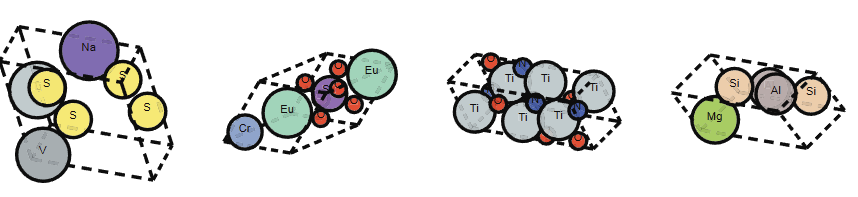

# Generative Models for 3D Atomistic Structure Discovery
## A Comparative Study

  

  
    Nima Shoghi, Timothy Soetojo, Jamshid Hassanpour
  

  Slides: [https://nima.sh/ece6254-presentation](nima.sh/ece6254-presentation)

<QRCode data="https://nima.sh/ece6254-presentation" />

<!--
Good afternoon everyone. Today we're presenting our project on generative models for 3D atomistic structure discovery.

This project explores how we can use AI to discover new materials by generating stable 3D atomic structures. Our work compares several cutting-edge deep learning approaches for this challenging task.

[The image shows a visualization of a crystal structure with atoms arranged in a 3D lattice - these complex arrangements determine the properties of materials we use every day, from electronics to medicine.]

We'll walk you through why this problem matters, our approach to solving it, and what we discovered from our experiments.
-->

---

# Why Materials Discovery Matters

<v-clicks>

- **Every technology starts with a material**
  - But discovery takes 20+ years lab-to-market

- **Finding the needle in a $10^{20}$ haystack**
  - Only ~1 in 100,000 structures are stable
  - Vast combinatorial space to explore

- **Generative ML: The "Virtual Lab"**
  - AI trained on known stable structures
  - Generates novel, physically realistic candidates
  - Impact: Batteries, Carbon Capture, Drug Delivery

</v-clicks>

  

<!--
Let's understand why materials discovery is so important and challenging.

[click] Every technology we rely on - from smartphones to solar panels - starts with a material discovery. But traditionally, bringing a new material from lab discovery to market application takes over 20 years. This slow cycle limits technological progress.

[click] The challenge is finding viable materials in an astronomically large search space. There are approximately 10²⁰ possible inorganic materials, but only about 1 in 100,000 structures are chemically stable enough to synthesize. Finding these rare stable structures manually is like finding a needle in a cosmic-sized haystack.

[click] This is where generative machine learning becomes our "virtual lab." By training AI on databases of known stable materials, we can generate novel candidates that have a much higher probability of stability. This approach could revolutionize how we discover materials for critical applications like next-generation batteries, carbon capture technologies, and targeted drug delivery systems.

[click] The image on the right shows a visualization of a crystal structure. Our project specifically compares different state-of-the-art generative methods to determine which approaches best capture the physical constraints that make materials stable in the real world.
-->

---
layout: default
---

# What Defines a Material Structure?

<v-clicks>

- **Fundamentally: Atoms in 3D Space**
  - Positions of atoms in xyz coordinates
  - Chemical elements at each position (C, Si, O, etc.)

- **Materials are Infinite Periodic Structures**
  - Not just a handful of atoms, but infinitely repeating
  - Most materials form ordered, crystalline arrangements

- **Three Essential Components**
  - Unit Cell/Lattice: The repeating 3D "box"
  - Atom Types: Elements present in the material
  - Fractional Coordinates: Positions within the cell (0-1)

</v-clicks>

  

    
    
Atoms within one unit cell

  

  

    
    
Infinitely repeating structure

  

<!--
Let's get concrete about what we're actually trying to generate.

[click] At the most basic level, materials are collections of atoms positioned in 3D space. Each atom has a specific location and a chemical identity (like carbon, silicon, or oxygen). This is an intuitive way to think about materials - just atoms arranged in space.

[click] But what makes materials science challenging is that real materials aren't just a handful of atoms - they're infinitely repeating structures. Most solid materials form ordered, crystalline arrangements where the same pattern of atoms repeats in all directions throughout space. This periodic nature is fundamental to understanding and generating materials.

[click] To efficiently represent these infinite structures, we need three components:
- The unit cell or lattice: a 3D "box" defined by vectors that repeats throughout space
- The atom types: which chemical elements are present in our material
- The fractional coordinates: where each atom sits within the unit cell, using a 0-1 scale relative to the cell dimensions

[click] Here you see a visualization of atoms within a single unit cell - this is our fundamental building block.

[click] And this shows how that unit cell repeats infinitely to form the complete material structure. Our generative models need to learn how to create all three components while ensuring the resulting structure is physically stable.
-->

---
layout: default
---

# Two Key Generative Tasks

  <h3 class="text-xl text-blue-700 mb-2">De Novo Generation (DNG)</h3>
  

  
?

  
→

  <!-- 2-Pnma.png) -->
  
  

  

  <b>Goal:</b> Generate completely new materials (composition + structure)
  

  

  <b>Evaluation metrics:</b> Validity, Coverage, Property Distribution
  

  <h3 class="text-xl text-green-700 mb-2">Crystal Structure Prediction (CSP)</h3>
  

  
SiO₂

  
→

  <!--  -->
  
  

  

  <b>Goal:</b> Predict stable structure given a specific composition (ie., chemical formula)
  

  

  <b>Evaluation metrics:</b> RMSE, Match Rate with ground truth
  

  Our study compares different generative approaches across both tasks

<!--
Let's understand the two fundamental generative tasks we're exploring in this project.

[click] First is De Novo Generation, or DNG. This is the more ambitious task where we aim to generate completely new materials from scratch. The model must learn to create both the chemical composition (what elements to use) and the 3D structure (how to arrange those atoms).

To evaluate DNG models, we look at:
- Validity: Are the generated structures physically plausible?
- Coverage: Do they represent diverse and realistic materials?
- Property distributions: Do their physical properties match those of real materials?

[click] The second task is Crystal Structure Prediction, or CSP. Here, we already know the chemical composition (like SiO₂ for quartz), but we need to predict the stable 3D arrangement of those atoms.

CSP is evaluated using:
- RMSE: How close are the predicted atom positions to the ground truth?
- Match Rate: What percentage of predictions match known structures within a reasonable tolerance?

[click] In our comparative study, we evaluate different generative approaches on both of these tasks to understand their strengths and limitations.
-->

---
layout: default
---

# Flow Matching: A More Efficient Alternative to Diffusion

<v-clicks>

- **Diffusion Models:** Stochastic random walks
  - Add random noise gradually (forward)
  - Learn to denoise step-by-step (reverse)
  - Uses SDE: $dx = f(x,t)dt + g(t)dw$

- **Flow Matching:** Deterministic straight paths
  - Direct transport from noise → data
  - Learn vector field for optimal flow
  - Uses ODE: $\frac{dx}{dt} = v_\theta(t, x)$

- **Advantages:**
  - More computationally efficient sampling
  - Simpler to train and implement
  - More flexible choice of base distribution

</v-clicks>

  <!--  -->
  
  <!--  -->
  
  

  FM learns **deterministic paths** from noise to data distribution

  

<!--
Let me explain Flow Matching and how it differs from diffusion models you might be more familiar with.

[click] Diffusion models work by gradually adding random noise to data in the forward process, then learning to reverse this process step by step. They're based on Stochastic Differential Equations, which involve randomness at each step. The equation shows how the change in x depends on both a deterministic term f and a stochastic term dw.

[click] Flow Matching, in contrast, learns deterministic straight-line paths from noise to data. Instead of random walks, it focuses on learning a vector field that transports points optimally between distributions. This approach uses Ordinary Differential Equations, which are deterministic. The equation shows how the change in x over time depends only on the learned vector field v_θ.

[click] The advantages of Flow Matching include significantly better computational efficiency during sampling, simpler training (no complex noise schedules to tune), and more flexibility in choosing base distributions, which is especially helpful for materials with complex geometries.

[click] In this illustration, you can see how Flow Matching learns direct paths from the noise distribution to the data distribution. Rather than meandering through a stochastic process, it follows optimal transport trajectories.

[click] This approach is particularly well-suited for our materials generation task because crystal structures have complex symmetries and constraints that are easier to handle with deterministic flows.
-->

---
layout: default
---

# FlowMM: Training and Sampling for Material Generation

<!--  -->

#### **Training the Vector Field:**
- Define base distributions for: atom positions (uniform on torus), atom types (binary encoding), lattice parameters (informed priors)
- Learn vector field $v_\theta$ that follows optimal transport paths
- Incorporates crystal symmetries: translation, rotation, permutation

#### **Sampling = Solving an ODE:**
- Draw from base distributions
- Integrate: $\frac{dx}{dt} = v_\theta(t, x)$ from $t=0$ to $t=1$
- Only ~50-250 steps needed (vs. 1000+ for diffusion)
- Result: Realistic 3D material structure

<!--
Now let's look at how FlowMM specifically works for generating materials. The image at the top visualizes how the vector field transforms random noise into realistic material structures.

[click] For training, FlowMM needs to learn a vector field that can transform simple distributions into complex material structures. It defines separate base distributions for different components:
- For atom positions, it uses a uniform distribution on a torus (to handle periodic boundary conditions)
- For atom types, it uses an efficient binary encoding rather than one-hot vectors
- For lattice parameters, it uses informed priors based on real materials

The model learns a vector field that follows optimal transport paths between these base distributions and real materials, while respecting crystal symmetries like translation, rotation, and permutation.

[click] For sampling, we simply solve an Ordinary Differential Equation. We:
1. Draw samples from our base distributions
2. Numerically integrate the ODE dx/dt = v_θ(t,x) from t=0 to t=1
3. The integration can be done with standard numerical methods like Euler or Runge-Kutta

The remarkable efficiency advantage is that we only need about 50-250 integration steps to get high-quality materials, compared to 1000+ steps typically needed for diffusion models. The result is a complete material specification with 3D atomic positions, atom types, and unit cell parameters that respect physical constraints and symmetries.
-->

---
layout: default
---

# Dataset and Evaluation Metrics

  <h3 class="text-2xl text-blue-700 mb-3">MP-20 Dataset</h3>
  

  <!--  -->
  
  

    
<b>45,231</b> materials

    
<b>89</b> elements

    
<b>1-20</b> atoms per unit cell

  

  

  

    Experimentally known inorganic materials with mostly globally stable structures.
  

  

    <h3 class="text-xl text-green-700 mb-2">DNG Metrics</h3>
    

      
<b>Validity:</b>

      
- Structural (atom spacing)

      
- Compositional (charge neutrality)

      
<b>Coverage:</b>

      
- Precision (realism of generated)

      
- Recall (diversity of generated)

      
<b>Property Distribution:</b>

      
- Density

      
- Number of elements

    

  

  

    <h3 class="text-xl text-purple-700 mb-2">CSP Metrics</h3>
    

      
<b>Match Rate:</b>

      
- % of predictions matching ground truth

      
- Measured within structural tolerance

      
<b>RMSE:</b>

      
- Error in predicted atom positions

      
- Normalized by unit cell dimensions

    

  

<!--
Let's discuss the dataset and metrics we'll be using to evaluate our comparative study.

[click] Our focus is the MP-20 dataset - a comprehensive collection of 45,231 materials with diverse compositions and structures drawn from the Materials Project database. This dataset includes:
- 89 different chemical elements
- Materials with 1 to 20 atoms per unit cell
- Experimentally verified inorganic materials

What makes MP-20 particularly valuable is that it contains mostly globally stable materials that can actually be synthesized in a laboratory. This means a model that performs well on MP-20 has real potential for practical materials discovery.

[click] For De Novo Generation - where we generate completely new materials from scratch - we evaluate using three families of metrics:
- Validity: Do the generated structures have reasonable atom spacing and charge-neutral compositions?
- Coverage: Do we generate diverse materials (recall) that are realistic (precision)?
- Property Distribution: Do statistical properties like density and elemental diversity match real materials?

[click] For Crystal Structure Prediction - where we predict the 3D structure given a composition - we use two primary metrics:
- Match Rate: The percentage of predictions that match ground truth structures within tolerance
- RMSE: The error in predicted atomic positions, normalized by the unit cell dimensions

These metrics together give us a comprehensive view of how well different generative approaches perform on the two key tasks in materials discovery.
-->

---

# Results Table

---

# Generated Samples
<
